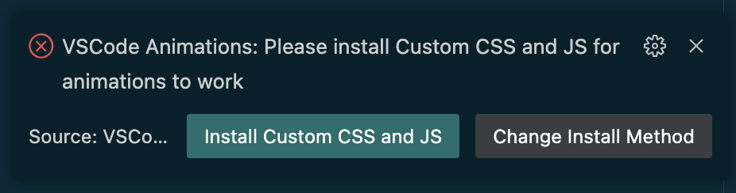
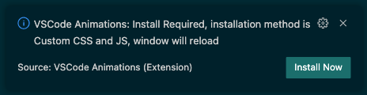
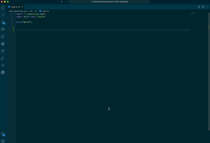
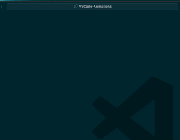
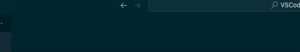
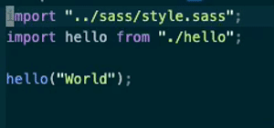
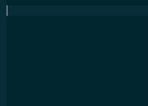
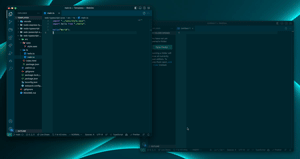

VSCode Animations

 

 
 

**VSCode Animations** is a Visual Studio Code extension that adds clean animations to the vscode UI. This is the **first** and **only** extension to add animations to vscode and is a **must-have** because vscode lacks many needed animations that this extension easily provides, not to mention that it also adds **many more** animations and is all **customizable**.

<!-- > This extension is actively being developed and will gain many more animations over time. Feel free to request any animations you would like to see added! -->

<!-- [Demo Video](https://github.com/BrandonKirbyson/VSCode-Animations/assets/86384607/b6f951e4-b246-4410-89ea-46cbc170ca6a) -->

The theme used in the demo is [Solarized Palenight](https://github.com/BrandonKirbyson/Solarized-Palenight).

Check it out on [github](https://github.com/BrandonKirbyson/VSCode-Animations)!

[@IgorBabko](https://github.com/igorbabko) made a good video about this extension: [https://youtu.be/Cd6NcXY4Exg?si=tSOhA3OxPVPrUBwF](https://youtu.be/Cd6NcXY4Exg?si=tSOhA3OxPVPrUBwF).
He goes through the initial setup, the options, and shows his cool vscode setup using this!
Also the official VSCode youtube made a short on it: [https://www.youtube.com/watch?v=QN0Pfz_ji6I](https://www.youtube.com/watch?v=QN0Pfz_ji6I)

## Note: [Apc Customize UI++](https://github.com/drcika/apc-extension) is currently not working as of [this issue](https://github.com/drcika/apc-extension/issues/230), use Custom CSS and JS Loader.

## Table of Contents

- [Getting Started](#getting-started)
- [Showcase](#showcase)
- [Commands](#commands)
- [Features & Customization](#features--customization)
- [Custom CSS](#custom-css)
- [Troubleshooting](#troubleshooting)
- [Contributing](#contributing)

## Getting Started

1. Install the extension with either of these methods:

   - Get it from the [VSCode Marketplace](https://marketplace.visualstudio.com/items?itemName=BrandonKirbyson.vscode-animations)

   - Search for `VSCode Animations` in the extensions tab in the editor

2. Install the injection extension, window will reload after install:

   - ## Note: [Apc Customize UI++](https://github.com/drcika/apc-extension) is currently not working as of [this issue](https://github.com/drcika/apc-extension/issues/230).

   - There are two options [Custom CSS and JS Loader](https://github.com/be5invis/vscode-custom-css)(default) and [Apc Customize UI++ (NOT WORKING)](https://github.com/drcika/apc-extension), see [Injection Extensions](#injection-extensions) for more info

     

   - For windows users, Apc Customize UI++ might work better, see [Injection Extensions](#injection-extensions) for more info

- Install the animations when prompted, window will reload final time

  - This is the injection extension installing the animations for you

    

3. Enjoy the animations!

If you have any issues, see [Troubleshooting](#troubleshooting).

> **For Custom CSS and JS:** You might see a prompt that says:
> `"VSCode installation is corrupt"`
>
> - To fix, click the settings icon on the notification and `"Do not show again"`.
> - Unfortunately custom js and css needs to be embedded into vscode's UI itself so vscode will throw a warning.

<!-- ### For Other Custom Injection Extension or Open VSX

> **Note:** If you are using the Custom CSS and JS extension on vscode, you do not need to do this.

This is for people that either could not get the Custom CSS and JS extension to work, want to use the extension on Open VSX, or want to use another extension that injects custom css and js.

If you want to do this, follow these steps:

- Disable `Auto Install` by setting `Auto Install` to `false` in settings, this will prevent the extension from trying to install via the Custom CSS and JS extension on startup.
- Use the command `Animations: Get Script Path` to get the path to the animations extension script, should copy to clipboard
- Add the path to your custom css and js loader and install however the extension requires

Here is a possible extension on Open VSX: [Apc Customize UI++](https://open-vsx.org/extension/drcika/apc-extension). I haven't tested it but it looks like it should work if you follow the instructions above and then use [apc.imports](https://open-vsx.org/extension/drcika/apc-extension#apc.imports) in that extension.

**ONLY DO THIS IF YOU KNOW WHAT YOU ARE DOING** but if you want to use another extension then you probably know what you are doing. If you do have any issues or questions feel free to open an issue.

> For people curious, the reason this extension does not inject the custom code itself is because it could conflict with any other custom injection extension. Becaue of this it is better to use a different extension to inject the code so that you and users can use a custom injection extension for other things as well -->

### Injection Extensions

The injection extension is what injects the custom css and js into vscode. There are two options:

#### [Custom CSS and JS Loader](https://github.com/be5invis/vscode-custom-css)

Pros:

- Default
- Tested more
- Requires just window reload on each install

Cons:

- Not on Open VSX
- Sometimes has issues on windows

#### [Apc Customize UI++](https://github.com/drcika/apc-extension)

Pros:

- Very active development
- On Open VSX
- Works better on windows
- Has many other features

Cons:

- Not default
- Newer, less tested
- Requires full app restart on each install

> **Note:** Make sure to only use one of these extensions at a time, having both installed will cause issues. If you want to switch, use the `Animations: Change Install Method` command and feel free to uninstall the other extension after window reloads.

##### Why use a separate extension?

The reason this extension does not inject the custom code itself is because it could conflict with any other custom injection extension.

## Showcase

Here is a little showcase of most of the animations. Sorry for the low quality gifs, they look much better in person!

> **Note:** The gifs are slowed down to show the animations better.

#### Smooth Mode

This is the main feature of the extension. It makes everything super smooth and clean!

#### Command Palette

This is fun and satisfying to use!

#### Tabs

A must-have for tabs!

#### Scrolling

Satisfying scrolling if you like that sort of thing!

#### Cursor

A nice little cursor animation, inspired by [this](https://github.com/qwreey75/dotfiles/tree/master/vscode/trailCursorEffect).

> If you are using the cursor animations from this extension, I recommend turning cursor blinking to `smooth` because `blink` can make the animation look a little weird.
> You can find this setting by searching for `Editor: Cursor Blinking` in settings (`cmd + ,` or `ctrl + ,`).

#### Active

A nice little animation for the active item!

#### Focus Dimming

A subtle dimming of unfocused windows

#### ...more coming soon!

## Commands

All commands can be found by pressing `cmd + shift + p` or `ctrl + shift + p` and searching for `Animations`.

| Command                               | Description                                                                                      |
| ------------------------------------- | ------------------------------------------------------------------------------------------------ |
| `Animations: Install Animations`      | Installs the animations js handler to vscode, requires reload                                    |
| `Animations: Enable Animations`       | Enables animation                                                                                |
| `Animations: Disable Animations`      | Disables animations                                                                              |
| `Animations: Open Animation Settings` | Opens the animations settings                                                                    |
| `Animations: Change Install Method`   | Changes the install method to either `Custom CSS and JS Loader` or `Apc Customize UI++`          |
| `Animations: Open Custom CSS`         | Opens the custom css file in a new tab                                                           |
| `Animations: Get Script Path`         | Copies the path to the animations js file to the clipboard for use in custom injection extension |

##### Enabling, disabling or customizing animations will instantly take effect. No need to reload!

## Features & Customization

You can customize the animations by running the `Animations: Open Animation Settings` command or opening settings (`cmd + ,` or `ctrl + ,`) and searching for `Animations`. There you can change the animation types, toggle animations, and change animation speeds.

### Types

For customizing each type of animation, you can refer to the list below to see what types of animations are available for each menu item.

| Menu Item         | Options                                                                                                         |
| ----------------- | --------------------------------------------------------------------------------------------------------------- |
| `Command Palette` | `None`, `Scale`, `Slide`, `Fade`                                                                                |
| `Tabs`            | `None`, `Scale`, `Slide`, `Flip`                                                                                |
| `Scrolling`       | `None`, `Scale`, `Slide`, `Fade`                                                                                |
| `Active`          | `None`, `Scale`, `Indent`                                                                                       |
| `Focus Dimming`   | `None`, `Full Window`, `Everything But Editor`, `Everything But Terminal`, `Everything But Editor and Terminal` |

### Toggles

You can toggle animations on and off for each menu item. This is useful if you want to disable animations for a specific menu item.

- `Smooth Mode`
- `Custom CSS`

### Durations

In settings, you can find the durations setting with is a json object that can apply custom durations to any animations. Reference the lists above to see what animations you can change the duration of.

### Cursor Animation

If you select `Us Cursor Color For Cursor Animation` it will use the current theme's cursor color for the cursor animation as expected, and it will live update when you change themes. If you want to use a custom color, you can turn this off and set the color in the `Cursor Animations Options` as seen below.

| Setting       | Description                                  | Options                          |
| ------------- | -------------------------------------------- | -------------------------------- |
| `Color`       | The color of the cursor animation            | `Hex` or `RGB` color as `string` |
| `Style`       | The type of animation to use for the cursor. | `Block`, `Line`                  |
| `TrailLength` | The length of the trail behind the cursor.   | `Number`                         |

### Focus Dimming

You can customize how the windows dims when it loses focus. In settings there are options to change the dimmed window's `opacity`, `duration`, and you can toggle `Full Window` mode which if turned on dims everything but if left off leaves the actual code editor full opacity.

## Custom CSS

You can customize the animations even further by editing the custom css file. You can open the custom css file by running the `Animations: Open Custom CSS` command or opening settings (`cmd + ,` or `ctrl + ,`) and searching for `Custom CSS`.

To find css selectors to use, you can use the `Developer: Toggle Developer Tools` command to inspect the editor and find the selectors you want to use.

##### The custom css file will live update

## Troubleshooting

If you are having issues with the extension, try these steps:

1. Run `Animations: Install Animations` command

   - Press `cmd + shift + p` or `ctrl + shift + p` and search for `Animations: Install Animations` and press enter, then reload when prompted

2. If you are on windows and the setting `Animations: Install Method` in settings is set to `Custom CSS and JS Loader`, try changing it to `Apc Customize UI++`

3. Make sure you have the either `Custom CSS and JS Loader` or `Apc Customize UI++` extension installed, if both are installed there may be conflicts

4. Uninstall and reinstall the extension

   - Your settings should be saved but your custom css if you have any will be deleted so make sure to back that up

#### For Linux

If you are having issues with the extension on Linux, try these steps (from issue [#42](https://github.com/BrandonKirbyson/VSCode-Animations/issues/42):

1.  Temporarily change ownership of VSCode dir: `sudo chown -Rv $USER:$USER /usr/share/code`

2.  Run VSCode and run through all installation steps (uninstall if it was already installed)

3.  Change ownership back to root (for security reasons): `sudo chown -Rv root:root /usr/share/code`

If you are still having issues, please open an issue.

## Contributing

If you have any suggestions or find an issue, please open an issue or a pull request.

 

### Enjoy the animations!
