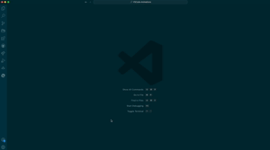
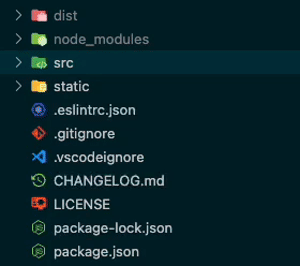

VSCode Animations

 

 
 

**VSCode Animations** is a Visual Studio Code extension that adds clean animations to the vscode UI. This is the **first** extension to add animations to vscode and is a **must-have** because vscode lacks many needed animations that this extension easily provides, not to mention that it also adds **many more** animations and is all **customizable**.

> This extension is actively being developed and will gain many more animations over time.

Check it out on [github](https://github.com/BrandonKirbyson/VSCode-Animations)!

## Table of Contents

- [Getting Started](#getting-started)
- [Showcase](#showcase)
- [Commands](#commands)
- [Features & Customization](#features--customization)
- [Custom CSS](#custom-css)
- [Troubleshooting](#troubleshooting)
- [Contributing](#contributing)

## Getting Started

1. Install the extension with either of these methods:

   - Get it from the [VSCode Marketplace](https://marketplace.visualstudio.com/items?itemName=BrandonKirbyson.vscode-animations)

   - Search for `VSCode Animations` in the extensions tab in the editor

2. Reload the editor when prompted
   Once you have installed and enabled `VSCode Animations`, you should get a popup that prompts you to reload for animations to take effect. Press `Reload` and you will see the animations be applied.

3. Enjoy the animations!

Check [here](#troubleshooting) if you have any issues.

##### Dependencies

This extension requires [Custom CSS and JS Loader](https://marketplace.visualstudio.com/items?itemName=be5invis.vscode-custom-css). If you do not have it installed, you will be prompted to install it.

It is an amazing extension that you can learn more about [here](https://github.com/be5invis/vscode-custom-css).

##### Personal Recommendation

I recommend turning on smooth cursor animations in vscode settings. This will make the cursor animate when moving it around the editor and looks really clean with this extension.

You can find this setting by searching for `Cursor Smooth Caret Animation` in settings (`cmd + ,` or `ctrl + ,`).

## Showcase

#### Command Palette

#### Tabs

#### Scrolling

#### Smooth Windows

#### Files

#### ...more coming soon!

## Commands

All commands can be found by pressing `cmd + shift + p` or `ctrl + shift + p` and searching for `Animations`.

| Command                               | Description                            |
| ------------------------------------- | -------------------------------------- |
| `Animations: Enable Animations`       | Enables animation                      |
| `Animations: Disable Animations`      | Disables animations                    |
| `Animations: Open Animation Settings` | Opens the animations settings          |
| `Animations: Open Custom CSS`         | Opens the custom css file in a new tab |

##### Enabling, disabling or customizing animations will instantly take effect. No need to reload!

## Features & Customization

You can customize the animations by running the `Animations: Open Animation Settings` command or opening settings (`cmd + ,` or `ctrl + ,`) and searching for `Animations`. There you can change the animation types, toggle animations, and change animation speeds.

### Types

For customizing each type of animation, you can refer to the list below to see what types of animations are available for each menu item.

| Menu Item         | Options                          |
| ----------------- | -------------------------------- |
| `Command Palette` | `None`, `Scale`, `Slide`         |
| `Tabs`            | `None`, `Scale`, `Slide`, `Flip` |
| `Scrolling`       | `None`, `Scale`, `Slide`, `Fade` |
| `Files`           | `None`, `Scale`, `Slide`, `Flip` |

### Toggles

You can toggle animations on and off for each menu item. This is useful if you want to disable animations for a specific menu item.

- `Smooth Windows`
- `Custom CSS`

### Durations

In settings, you can find the durations setting with is a json object that can apply custom durations to any animations. Reference the lists above to see what animations you can change the duration of.

## Custom CSS

You can customize the animations even further by editing the custom css file. You can open the custom css file by running the `Animations: Open Custom CSS` command or opening settings (`cmd + ,` or `ctrl + ,`) and searching for `Custom CSS`.

To find css selectors to use, you can use the `Developer: Toggle Developer Tools` command to inspect the editor and find the selectors you want to use.

##### The custom css file will live update

## Troubleshooting

If you are having issues with the extension, try these steps:

1. Reload the editor

   - Press `cmd + shift + p` or `ctrl + shift + p` and search for `Reload Window` and press enter

2. Make sure you have the [Custom CSS and JS Loader](https://marketplace.visualstudio.com/items?itemName=be5invis.vscode-custom-css) extension installed

3. Enable Custom CSS and JS Extension

   - Press `cmd + shift + p` or `ctrl + shift + p` and search for `Enable Custom CSS and JS` and press enter, then reload when prompted

4. Check the custom css file for errors
   - Press `cmd + shift + p` or `ctrl + shift + p` and search for `Open Custom CSS` and press enter
   - Check to see if you made any errors or possibly overrided other styling

If you are still having issues, please open an issue.

## Contributing

If you have any suggestions or find an issue, please open an issue or pull request.

If you would like to request an animation, please open an issue with the `animation` label and I will try to add it. If you have the css for the animation, please include it in the issue and I can integrate it into the extension.

 

### Enjoy the animations!
